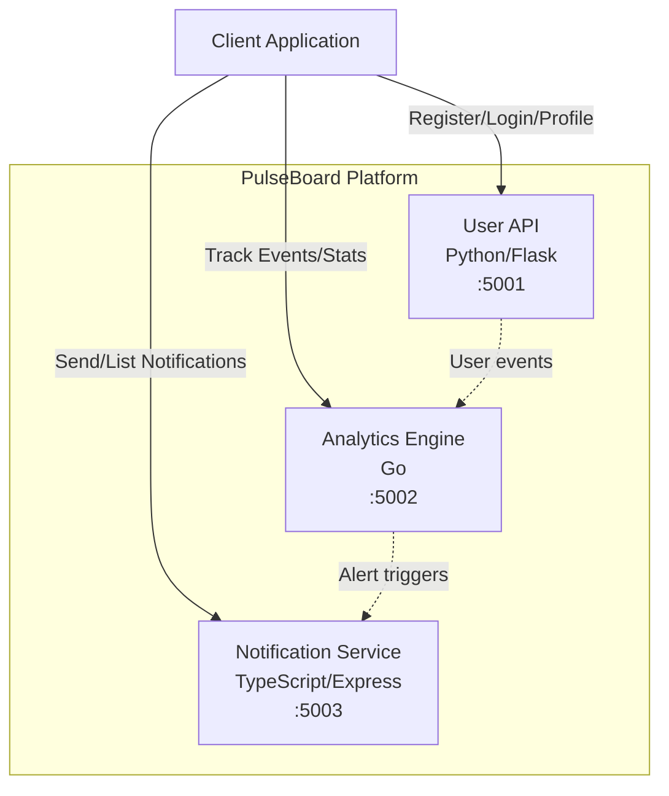

# PulseBoard Platform

Real-time microservices dashboard platform with user management, analytics tracking, and multi-channel notification delivery.

## Architecture



## Services

| Service | Language | Port | Description |
|---------|----------|------|-------------|
| User API | Python (Flask) | 5001 | User registration, authentication (JWT), profile management |
| Analytics Engine | Go (net/http) | 5002 | Event tracking, real-time statistics, event aggregation |
| Notification Service | TypeScript (Express) | 5003 | Multi-channel notifications (email, SMS, push) |

## Quick Start

### Prerequisites

- Docker & Docker Compose
- Or: Python 3.12+, Go 1.22+, Node.js 20+

### Using Docker Compose

```bash
cp .env.example .env
make up
```

### Manual Setup

```bash
# User API
cd services/user-api
pip install -r requirements.txt
python app.py

# Analytics Engine
cd services/analytics-engine
go run main.go

# Notification Service
cd services/notification-service
npm install
npm run dev
```

## API Reference

### User API (`:5001`)

| Method | Endpoint | Description |
|--------|----------|-------------|
| GET | `/health` | Health check |
| POST | `/api/users/register` | Register a new user |
| POST | `/api/users/login` | Login and receive JWT |
| GET | `/api/users/me` | Get current user profile (requires JWT) |
| GET | `/api/users` | List all users |

**Register:**
```bash
curl -X POST http://localhost:5001/api/users/register \
  -H "Content-Type: application/json" \
  -d '{"email":"user@example.com","password":"secret","name":"Alice"}'
```

**Login:**
```bash
curl -X POST http://localhost:5001/api/users/login \
  -H "Content-Type: application/json" \
  -d '{"email":"user@example.com","password":"secret"}'
```

### Analytics Engine (`:5002`)

| Method | Endpoint | Description |
|--------|----------|-------------|
| GET | `/health` | Health check |
| POST | `/api/analytics/track` | Track an event |
| GET | `/api/analytics/stats` | Get aggregated statistics |
| GET | `/api/analytics/events` | List all events |

**Track Event:**
```bash
curl -X POST http://localhost:5002/api/analytics/track \
  -H "Content-Type: application/json" \
  -d '{"user_id":"u1","event_type":"page_view","payload":"homepage"}'
```

### Notification Service (`:5003`)

| Method | Endpoint | Description |
|--------|----------|-------------|
| GET | `/health` | Health check |
| POST | `/api/notifications/send` | Send a notification |
| GET | `/api/notifications` | List notifications (optional `?user_id=`) |
| GET | `/api/notifications/:id` | Get notification by ID |

**Send Notification:**
```bash
curl -X POST http://localhost:5003/api/notifications/send \
  -H "Content-Type: application/json" \
  -d '{"user_id":"u1","channel":"email","title":"Welcome","message":"Hello!"}'
```

## Development

### Running Tests

```bash
make test          # Run all tests
make test-python   # Python tests only
make test-go       # Go tests only
make test-ts       # TypeScript tests only
```

### Linting

```bash
make lint          # Run all linters
make lint-python   # flake8
make lint-go       # go vet
make lint-ts       # eslint
```

### Health Check

```bash
make health        # Check all services
```

## Environment Variables

See [`.env.example`](.env.example) for all available configuration options.

| Variable | Default | Description |
|----------|---------|-------------|
| `USER_API_PORT` | `5001` | User API listen port |
| `JWT_SECRET` | `pulseboard-dev-secret` | JWT signing secret |
| `TOKEN_EXPIRY_HOURS` | `24` | JWT token expiry in hours |
| `ANALYTICS_PORT` | `5002` | Analytics Engine listen port |
| `NOTIFICATION_PORT` | `5003` | Notification Service listen port |
| `LOG_LEVEL` | `INFO` | Log verbosity level |

## CI/CD

GitHub Actions workflow runs on push/PR to `main`:
1. Python: install deps, flake8 lint, pytest
2. Go: go vet, go test
3. TypeScript: npm ci, eslint, jest
4. Docker: compose build (after all tests pass)

> **Note:** The `.github/workflows/ci.yml` file may need to be added manually after initial setup due to GitHub API restrictions on the `.github/` directory.

## Project Structure

```
pulseboard-platform/
├── docker-compose.yml
├── Makefile
├── .env.example
├── .gitignore
├── README.md
└── services/
    ├── user-api/           # Python/Flask
    │   ├── app.py
    │   ├── test_app.py
    │   ├── requirements.txt
    │   └── Dockerfile
    ├── analytics-engine/   # Go
    │   ├── main.go
    │   ├── main_test.go
    │   ├── go.mod
    │   └── Dockerfile
    └── notification-service/  # TypeScript/Express
        ├── src/
        │   ├── index.ts
        │   └── index.test.ts
        ├── package.json
        ├── tsconfig.json
        ├── jest.config.js
        └── Dockerfile
```

## License

MIT
